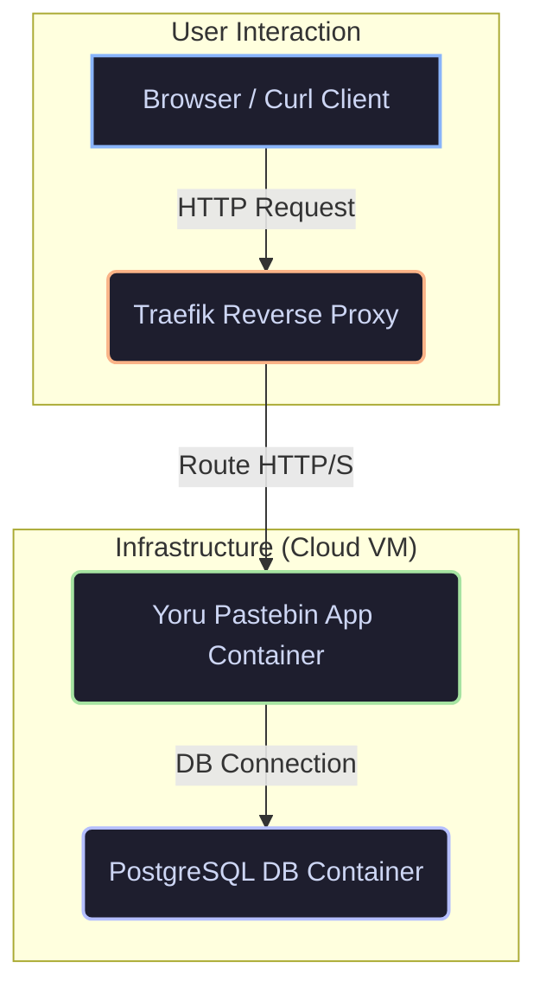
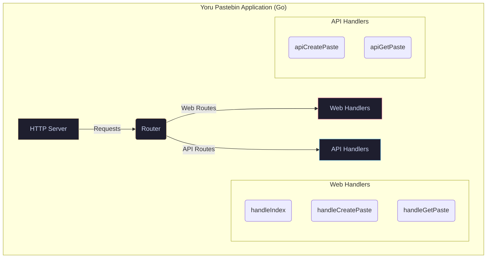
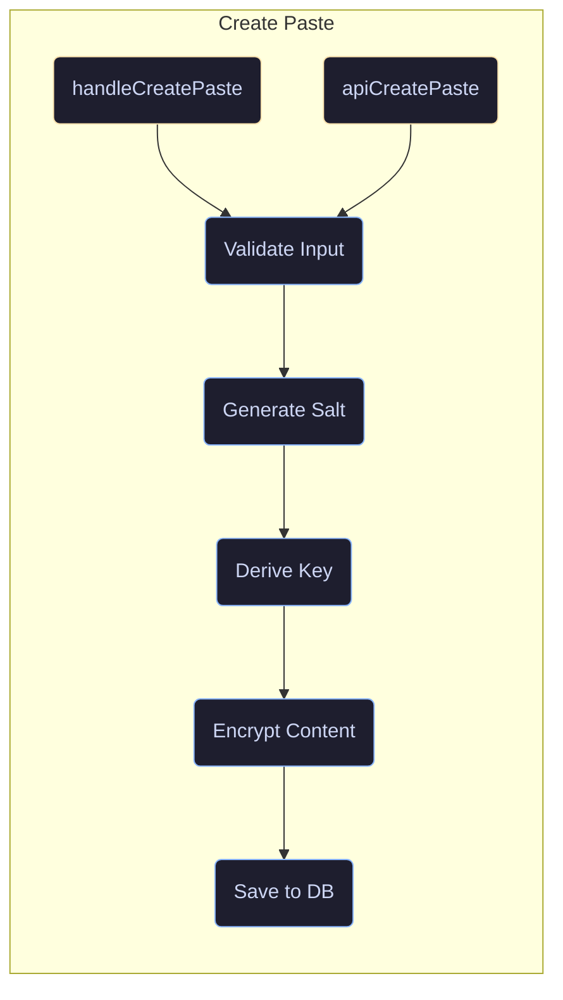
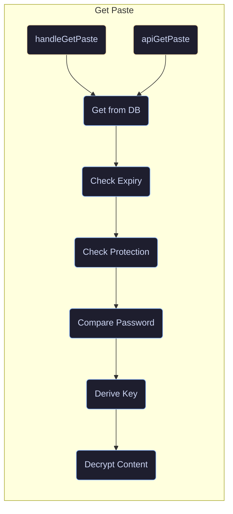
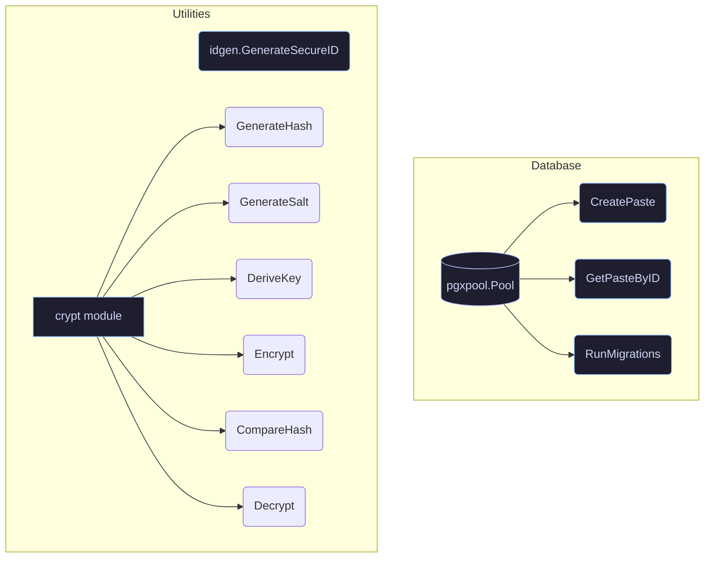

## Infra Structure

```mermaid
graph TD
    subgraph "User Interaction"
        A[Browser / Curl Client] -- HTTP Request --> B(Traefik Reverse Proxy)
    end
    
    subgraph "Infrastructure (Cloud VM)"
        B -- Route HTTP/S --> C(Yoru Pastebin App Container)
        C -- DB Connection --> D(PostgreSQL DB Container)
    end

    style A fill:#1e1e2e,stroke:#89b4fa,stroke-width:2px,color:#cdd6f4
    style B fill:#1e1e2e,stroke:#fab387,stroke-width:2px,color:#cdd6f4
    style C fill:#1e1e2e,stroke:#a6e3a1,stroke-width:2px,color:#cdd6f4
    style D fill:#1e1e2e,stroke:#b4befe,stroke-width:2px,color:#cdd6f4

```

## App Core Flow

```mermaid
graph TD
    subgraph "Yoru Pastebin Application (Go)"
        C1[HTTP Server] -- Requests --> C2(Router)
        C2 -- Web Routes --> Web[Web Handlers]
        C2 -- API Routes --> API[API Handlers]
        
        subgraph "Web Handlers"
            C3(handleIndex)
            C4(handleCreatePaste)
            C5(handleGetPaste)
        end
        
        subgraph "API Handlers"
            C6(apiCreatePaste)
            C7(apiGetPaste)
        end
    end
    
    style C1 fill:#1e1e2e,stroke:#f9e2af,stroke-width:1px,color:#cdd6f4
    style C2 fill:#1e1e2e,stroke:#f9e2af,stroke-width:1px,color:#cdd6f4
    style Web fill:#1e1e2e,stroke:#f38ba8,stroke-width:1px,color:#cdd6f4
    style API fill:#1e1e2e,stroke:#74c7ec,stroke-width:1px,color:#cdd6f4

```

## Paste Creation 

```mermaid

graph LR
    subgraph "Create Paste"
        C4(handleCreatePaste) --> P1(Validate Input)
        P1 --> Cr1(Generate Salt)
        Cr1 --> Cr2(Derive Key)
        Cr2 --> Cr3(Encrypt Content)
        Cr3 --> PR1(Save to DB)
        
        C6(apiCreatePaste) --> P1
    end
    
    style C4 fill:#1e1e2e,stroke:#f9e2af,stroke-width:1px,color:#cdd6f4
    style C6 fill:#1e1e2e,stroke:#f9e2af,stroke-width:1px,color:#cdd6f4
    style P1 fill:#1e1e2e,stroke:#89b4fa,stroke-width:1px,color:#cdd6f4
    style Cr1 fill:#1e1e2e,stroke:#89b4fa,stroke-width:1px,color:#cdd6f4
    style Cr2 fill:#1e1e2e,stroke:#89b4fa,stroke-width:1px,color:#cdd6f4
    style Cr3 fill:#1e1e2e,stroke:#89b4fa,stroke-width:1px,color:#cdd6f4
    style PR1 fill:#1e1e2e,stroke:#89b4fa,stroke-width:1px,color:#cdd6f4

```

## Paste Retrieval

```mermaid
graph LR
    subgraph "Get Paste"
        C5(handleGetPaste) --> PR2(Get from DB)
        PR2 --> P2(Check Expiry)
        P2 --> P3(Check Protection)
        P3 --> Cr4(Compare Password)
        Cr4 --> Cr5(Derive Key)
        Cr5 --> Cr6(Decrypt Content)
        
        C7(apiGetPaste) --> PR2
    end
    
    style C5 fill:#1e1e2e,stroke:#f9e2af,stroke-width:1px,color:#cdd6f4
    style C7 fill:#1e1e2e,stroke:#f9e2af,stroke-width:1px,color:#cdd6f4
    style PR2 fill:#1e1e2e,stroke:#89b4fa,stroke-width:1px,color:#cdd6f4
    style P2 fill:#1e1e2e,stroke:#89b4fa,stroke-width:1px,color:#cdd6f4
    style P3 fill:#1e1e2e,stroke:#89b4fa,stroke-width:1px,color:#cdd6f4
    style Cr4 fill:#1e1e2e,stroke:#89b4fa,stroke-width:1px,color:#cdd6f4
    style Cr5 fill:#1e1e2e,stroke:#89b4fa,stroke-width:1px,color:#cdd6f4
    style Cr6 fill:#1e1e2e,stroke:#89b4fa,stroke-width:1px,color:#cdd6f4

```

## Database & Utils

```mermaid 
graph TB
    subgraph "Database"
        D1[(pgxpool.Pool)] --> PR1(CreatePaste)
        D1 --> PR2(GetPasteByID)
        D1 --> D2(RunMigrations)
    end
    
    subgraph "Utilities"
        U1(idgen.GenerateSecureID)
        Crypt[crypt module] --> Cr1(GenerateHash)
        Crypt --> Cr2(GenerateSalt)
        Crypt --> Cr3(DeriveKey)
        Crypt --> Cr4(Encrypt)
        Crypt --> Cr5(CompareHash)
        Crypt --> Cr6(Decrypt)
    end
    
    style D1 fill:#1e1e2e,stroke:#b4befe,stroke-width:1px,color:#cdd6f4
    style PR1 fill:#1e1e2e,stroke:#89b4fa,stroke-width:1px,color:#cdd6f4
    style PR2 fill:#1e1e2e,stroke:#89b4fa,stroke-width:1px,color:#cdd6f4
    style D2 fill:#1e1e2e,stroke:#89b4fa,stroke-width:1px,color:#cdd6f4
    style U1 fill:#1e1e2e,stroke:#89b4fa,stroke-width:1px,color:#cdd6f4
    style Crypt fill:#1e1e2e,stroke:#89b4fa,stroke-width:1px,color:#cdd6f4

```