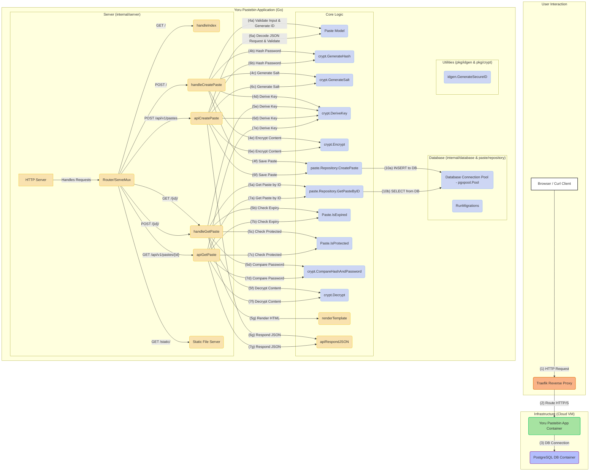

```mermaid
graph TD
    subgraph "User Interaction"
        A[Browser / Curl Client] -- (1) HTTP Request --> B(Traefik Reverse Proxy)
    end

    subgraph "Infrastructure (Cloud VM)"
        B -- (2) Route HTTP/S --> C(Yoru Pastebin App Container)
        C -- (3) DB Connection --> D(PostgreSQL DB Container)
    end

    subgraph "Yoru Pastebin Application (Go)"
        subgraph "Server (internal/server)"
            C1[HTTP Server] -- Handles Requests --> C2(Router/ServeMux)
            C2 -- GET / --> C3(handleIndex)
            C2 -- POST / --> C4(handleCreatePaste)
            C2 -- GET /{id}/ --> C5(handleGetPaste)
            C2 -- POST /{id}/ --> C5
            C2 -- POST /api/v1/pastes --> C6(apiCreatePaste)
            C2 -- GET /api/v1/pastes/{id} --> C7(apiGetPaste)
            C2 -- GET /static/ --> C8(Static File Server)
        end

        subgraph "Core Logic"
            C4 -- (4a) Validate Input & Generate ID --> P1(Paste Model)
            C4 -- (4b) Hash Password --> Cr1(crypt.GenerateHash)
            C4 -- (4c) Generate Salt --> Cr2(crypt.GenerateSalt)
            C4 -- (4d) Derive Key --> Cr3(crypt.DeriveKey)
            C4 -- (4e) Encrypt Content --> Cr4(crypt.Encrypt)
            C4 -- (4f) Save Paste --> PR1(paste.Repository.CreatePaste)

            C5 -- (5a) Get Paste by ID --> PR2(paste.Repository.GetPasteByID)
            C5 -- (5b) Check Expiry --> P2(Paste.IsExpired)
            C5 -- (5c) Check Protected --> P3(Paste.IsProtected)
            C5 -- (5d) Compare Password --> Cr5(crypt.CompareHashAndPassword)
            C5 -- (5e) Derive Key --> Cr3
            C5 -- (5f) Decrypt Content --> Cr6(crypt.Decrypt)
            C5 -- (5g) Render HTML --> C9(renderTemplate)

            C6 -- (6a) Decode JSON Request & Validate --> P1
            C6 -- (6b) Hash Password --> Cr1
            C6 -- (6c) Generate Salt --> Cr2
            C6 -- (6d) Derive Key --> Cr3
            C6 -- (6e) Encrypt Content --> Cr4
            C6 -- (6f) Save Paste --> PR1
            C6 -- (6g) Respond JSON --> C10(apiRespondJSON)

            C7 -- (7a) Get Paste by ID --> PR2
            C7 -- (7b) Check Expiry --> P2
            C7 -- (7c) Check Protected --> P3
            C7 -- (7d) Compare Password --> Cr5
            C7 -- (7e) Derive Key --> Cr3
            C7 -- (7f) Decrypt Content --> Cr6
            C7 -- (7g) Respond JSON --> C10
        end

        subgraph "Database (internal/database & paste/repository)"
            D1(Database Connection Pool - pgxpool.Pool)
            D2(RunMigrations)
            PR1 -- (10a) INSERT to DB --> D1
            PR2 -- (10b) SELECT from DB --> D1
        end

        subgraph "Utilities (pkg/idgen & pkg/crypt)"
            U1(idgen.GenerateSecureID)
            Cr1(crypt.GenerateHash)
            Cr2(crypt.GenerateSalt)
            Cr3(crypt.DeriveKey)
            Cr4(crypt.Encrypt)
            Cr5(crypt.CompareHashAndPassword)
            Cr6(crypt.Decrypt)
        end
    end

    style A fill:#fff,stroke:#333,stroke-width:2px
    style B fill:#fab387,stroke:#e67e22,stroke-width:2px
    style C fill:#a6e3a1,stroke:#2ecc71,stroke-width:2px
    style D fill:#b4befe,stroke:#9b59b6,stroke-width:2px

    style C1 fill:#f9e2af,stroke:#f1c40f,stroke-width:1px
    style C2 fill:#f9e2af,stroke:#f1c40f,stroke-width:1px
    style C3 fill:#f9e2af,stroke:#f1c40f,stroke-width:1px
    style C4 fill:#f9e2af,stroke:#f1c40f,stroke-width:1px
    style C5 fill:#f9e2af,stroke:#f1c40f,stroke-width:1px
    style C6 fill:#f9e2af,stroke:#f1c40f,stroke-width:1px
    style C7 fill:#f9e2af,stroke:#f1c40f,stroke-width:1px
    style C8 fill:#f9e2af,stroke:#f1c40f,stroke-width:1px
    style C9 fill:#f9e2af,stroke:#f1c40f,stroke-width:1px
    style C10 fill:#f9e2af,stroke:#f1c40f,stroke-width:1px

    style P1 fill:#cdd6f4,stroke:#89b4fa,stroke-width:1px
    style P2 fill:#cdd6f4,stroke:#89b4fa,stroke-width:1px
    style P3 fill:#cdd6f4,stroke:#89b4fa,stroke-width:1px
    style PR1 fill:#cdd6f4,stroke:#89b4fa,stroke-width:1px
    style PR2 fill:#cdd6f4,stroke:#89b4fa,stroke-width:1px

    style D1 fill:#cdd6f4,stroke:#89b4fa,stroke-width:1px
    style D2 fill:#cdd6f4,stroke:#89b4fa,stroke-width:1px

    style U1 fill:#cdd6f4,stroke:#89b4fa,stroke-width:1px
    style Cr1 fill:#cdd6f4,stroke:#89b4fa,stroke-width:1px
    style Cr2 fill:#cdd6f4,stroke:#89b4fa,stroke-width:1px
    style Cr3 fill:#cdd6f4,stroke:#89b4fa,stroke-width:1px
    style Cr4 fill:#cdd6f4,stroke:#89b4fa,stroke-width:1px
    style Cr5 fill:#cdd6f4,stroke:#89b4fa,stroke-width:1px
    style Cr6 fill:#cdd6f4,stroke:#89b4fa,stroke-width:1px

```